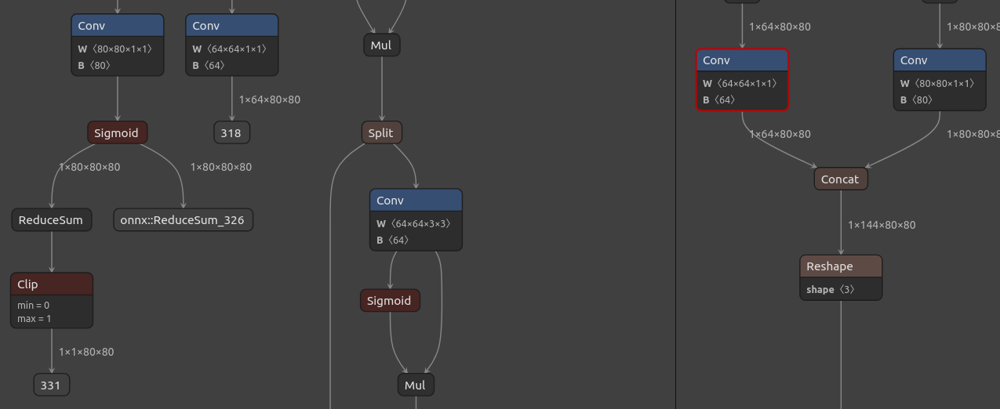
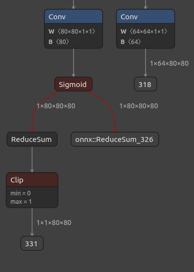
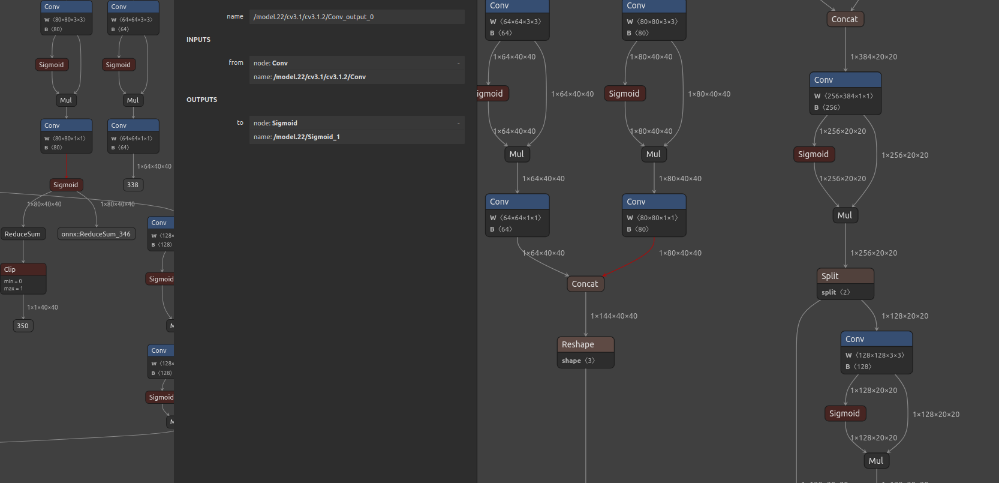
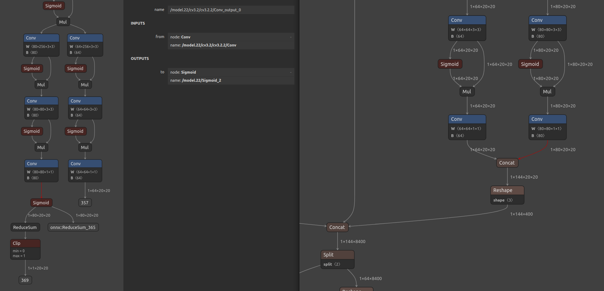

# Что было изменино?

# По общим слоям можно понять, что было измененно

## 1. Порезанный слой `/model.22/cv2.0/cv2.0.2/Conv`




У слоя `/model.22/cv3.0/cv3.0.2/Conv`

Добавлены операции

* функция активации Sigmoid - нормализация от [0,1]

Размер вектора [1x80x80x80]

### **Разделение вектора**

#### **Ветвь 1**

* onnx::ReduceSum_326 - сложение элементов по какой оси

Размер выходного вектора [1x1x40x40]

#### **Ветвь 2**

* `ReduceSum` - сложение по оси x

Пример вычислений на пример вектора [1x2x5x5] -> [1x1x5x5]:

Исходные значения
```
[
  [  # Канал 0
    [1, 2, 3, 4, 5],
    [6, 7, 8, 9, 10],
    [11, 12, 13, 14, 15],
    [16, 17, 18, 19, 20],
    [21, 22, 23, 24, 25]
  ],
  [  # Канал 1
    [26, 27, 28, 29, 30],
    [31, 32, 33, 34, 35],
    [36, 37, 38, 39, 40],
    [41, 42, 43, 44, 45],
    [46, 47, 48, 49, 50]
  ]
]


output(0,0) = 1 + 26, output(0,1) = 2+7 etc

```


* CLIP - нормализация значений от [0,1]

Размер вектора [1x1x40x40]




## 2. Порезанный слой `/model.22/cv3.1/cv3.1.2/Conv`



Добавлены аналогичные операции, что и в прошлом примере.

## 2. Порезанный слой `/model.22/cv3.2/cv3.2.2/Conv`



Добавлены аналогичные операции, что и в прошлом примере.


